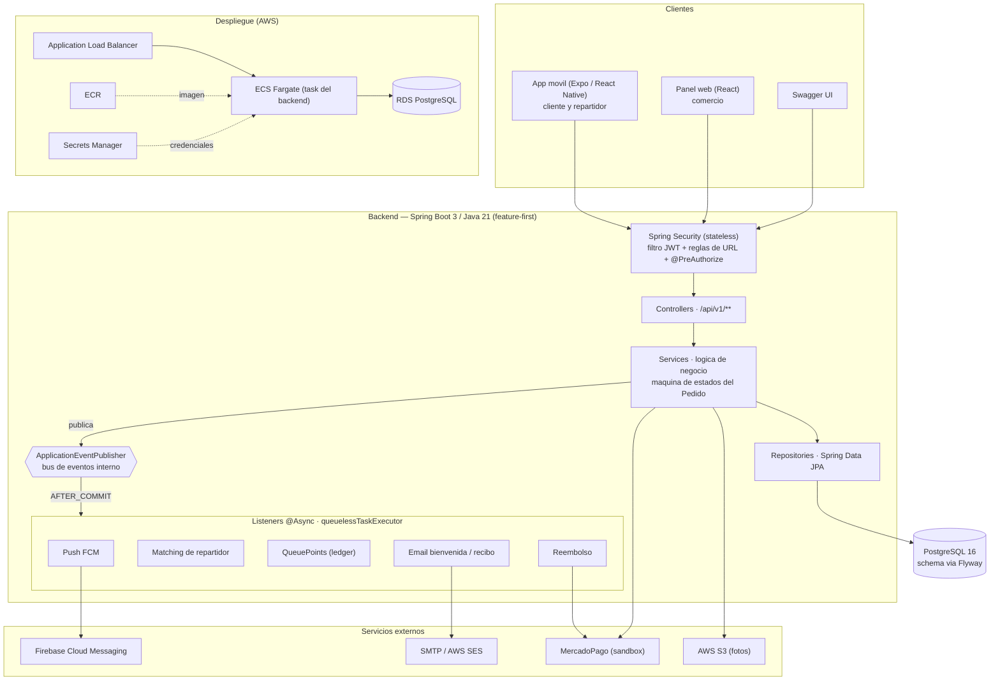

# Arquitectura del backend

Este diagrama muestra la estructura técnica real del backend de QueueLess: las capas por las
que pasa una request, el bus de eventos interno que desacopla los módulos, los servicios
externos y el despliegue en AWS. El **porqué** de la organización por feature vive en
[ADR-0001](../decisiones/ADR-0001-estructura-feature-first.md); acá mostramos el **qué**.

## Cómo leerlo

- **Una request** entra por la cadena de seguridad (valida el JWT y el rol), llega al
  controller versionado bajo `/api/v1`, baja a un service y de ahí al repositorio JPA y a
  Postgres. La autorización es *defense-in-depth*: reglas de URL **y** `@PreAuthorize`
  ([ADR-0022](../decisiones/ADR-0022-versionado-api-v1-y-autorizacion-por-metodo.md)).
- **Los efectos derivados** no van inline: el service publica un evento y los listeners
  reaccionan en `AFTER_COMMIT` sobre el `queuelessTaskExecutor`, sin bloquear la respuesta
  HTTP ([ADR-0009](../decisiones/ADR-0009-eventos-de-dominio.md)). Así el push
  ([ADR-0016](../decisiones/ADR-0016-notificaciones-push-firebase.md)), el correo
  ([ADR-0021](../decisiones/ADR-0021-email-complementario-al-push.md)), el matching de
  delivery ([ADR-0014](../decisiones/ADR-0014-flujo-delivery-matching-y-opciones-del-cliente.md)),
  los QueuePoints ([ADR-0008](../decisiones/ADR-0008-ledger-pattern-queuepoints.md)) y el
  reembolso ([ADR-0013](../decisiones/ADR-0013-integracion-con-pasarela-de-pagos.md)) viven
  desacoplados del módulo que los dispara.
- **Los servicios externos** (FCM, SMTP, MercadoPago, S3) se resuelven detrás de fachadas con
  `ObjectProvider`, así el backend arranca y funciona en dev aunque no estén configurados. El
  almacenamiento de archivos cae a disco local si no hay S3 ([ADR-0017](../decisiones/ADR-0017-almacenamiento-de-archivos.md)).
- **En producción**, la imagen vive en ECR, corre como task de ECS Fargate detrás de un ALB,
  contra RDS PostgreSQL, con los secretos inyectados desde Secrets Manager
  ([ADR-0018](../decisiones/ADR-0018-hardening-perfil-produccion.md)).
