# Modelo Entidad-Relación

Este diagrama muestra las **12 entidades** del dominio de QueueLess y cómo se relacionan
en la base de datos. Lo validamos contra las migraciones Flyway (`db/migration/V1..V5`) y
las entidades JPA reales. Cómo leerlo:

- **Línea sólida** (`||--o{`): relación con **FK real** en la base.
- **Línea punteada** (`|o..o{`): **referencia polimórfica blanda** — una columna `bigint`
  suelta, sin FK, donde el tipo del objetivo se guarda aparte en una columna `*_tipo`.
- `PK` = clave primaria, `FK` = clave foránea, `UK` = unique.

```mermaid
erDiagram
    USUARIO ||--o| PERFIL_CLIENTE     : "tiene perfil"
    USUARIO ||--o| PERFIL_COMERCIO    : "tiene perfil"
    USUARIO ||--o| PERFIL_REPARTIDOR  : "tiene perfil"
    USUARIO ||--o{ USUARIO_ROLES      : "tiene roles"
    USUARIO ||--o{ PUNTO_DE_VENTA     : "gestiona"
    USUARIO ||--o{ PEDIDO             : "realiza como cliente"
    USUARIO ||--o{ RESENA             : "escribe como autor"
    USUARIO ||--o{ MOVIMIENTO_QUEUEPOINTS : "registra"
    USUARIO |o--o{ SOLICITUD_DELIVERY : "atiende como repartidor"

    PUNTO_DE_VENTA ||--o{ PRODUCTO    : "ofrece"
    PUNTO_DE_VENTA ||--o{ PEDIDO      : "recibe"

    PEDIDO ||--|{ ITEM_PEDIDO         : "contiene"
    PEDIDO ||--o| PAGO                : "se paga con"
    PEDIDO ||--o| SOLICITUD_DELIVERY  : "puede requerir"
    PEDIDO ||--o{ RESENA              : "origina"

    PRODUCTO ||--o{ ITEM_PEDIDO       : "se pide en"

    %% Referencias polimorficas (sin FK, validadas a nivel de servicio):
    %% Resena.objetivo_id apunta a PUNTO_DE_VENTA o a USUARIO (repartidor) segun objetivo_tipo.
    PUNTO_DE_VENTA |o..o{ RESENA      : "objetivo si tipo PUNTO_DE_VENTA"
    USUARIO        |o..o{ RESENA      : "objetivo si tipo REPARTIDOR"
    %% MovimientoQueuePoints.referencia_id es polimorfica: referencia_tipo en PEDIDO / ENTREGA / BONO.
    PEDIDO |o..o{ MOVIMIENTO_QUEUEPOINTS : "referencia opcional"

    USUARIO {
        bigint    id              PK
        varchar   email           UK "NOT NULL, max 150"
        varchar   password_hash      "NOT NULL"
        varchar   nombre_completo    "NOT NULL, max 150"
        boolean   activo             "NOT NULL, default true"
        timestamp created_at         "auto, trigger"
        timestamp updated_at         "auto, trigger"
    }

    USUARIO_ROLES {
        bigint  usuario_id PK,FK "ON DELETE CASCADE"
        varchar rol        PK    "CLIENTE / COMERCIO / REPARTIDOR"
    }

    PERFIL_CLIENTE {
        bigint    usuario_id          PK,FK "MapsId, ON DELETE CASCADE"
        varchar   direccion_preferida       "max 200, nullable"
        text      alergias                  "nullable"
        int       total_pedidos             "NOT NULL, default 0"
        timestamp created_at
        timestamp updated_at
    }

    PERFIL_COMERCIO {
        bigint    usuario_id        PK,FK "MapsId, ON DELETE CASCADE"
        varchar   ruc                     "max 11, nullable - SUNAT"
        varchar   contacto_telefono       "max 20, nullable"
        varchar   contacto_email          "max 150, nullable"
        timestamp created_at
        timestamp updated_at
    }

    PERFIL_REPARTIDOR {
        bigint    usuario_id            PK,FK "MapsId, ON DELETE CASCADE"
        numeric   calificacion_promedio       "precision 3 escala 2, nullable"
        int       total_entregas              "NOT NULL, default 0"
        boolean   disponible                  "NOT NULL, default false"
        timestamp created_at
        timestamp updated_at
    }

    PUNTO_DE_VENTA {
        bigint    id                        PK
        varchar   nombre                       "NOT NULL, max 120"
        varchar   ubicacion                    "NOT NULL, max 200"
        time      horario_apertura             "nullable"
        time      horario_cierre               "nullable"
        int       tiempo_promedio_declarado    "NOT NULL, default 10 min"
        boolean   abierto                      "NOT NULL, default true"
        boolean   activo                       "NOT NULL, default true - soft delete"
        bigint    gestor_usuario_id         FK "NOT NULL - Usuario rol COMERCIO"
        timestamp created_at
        timestamp updated_at
    }

    PRODUCTO {
        bigint    id                       PK
        bigint    punto_de_venta_id        FK "NOT NULL, ON DELETE CASCADE"
        varchar   nombre                      "NOT NULL, max 120"
        text      descripcion                 "nullable"
        numeric   precio                      "NOT NULL, precision 8 escala 2, >= 0"
        varchar   foto_url                    "max 500, nullable"
        varchar   categoria                   "max 50, nullable"
        varchar   tipo_preparacion            "NOT NULL - PREPARADO / INSTANTANEO"
        boolean   disponible                  "NOT NULL, default true"
        time      horario_servicio_inicio     "nullable"
        time      horario_servicio_fin        "nullable"
        boolean   tiene_ventana_de_pedido     "NOT NULL, default false"
        time      ventana_pedido_inicio       "nullable"
        time      ventana_pedido_fin          "nullable"
        time      ventana_recojo_inicio       "nullable"
        time      ventana_recojo_fin          "nullable"
        timestamp created_at
        timestamp updated_at
    }

    PEDIDO {
        bigint    id                  PK
        varchar   codigo              UK "NOT NULL, max 20"
        bigint    cliente_id          FK "NOT NULL - Usuario"
        bigint    punto_de_venta_id   FK "NOT NULL"
        varchar   estado                 "NOT NULL - 11 estados, max 40"
        varchar   tipo_entrega           "NOT NULL - PICKUP / DELIVERY"
        numeric   subtotal               "NOT NULL, precision 8 escala 2"
        numeric   descuento_qpts         "NOT NULL, default 0"
        numeric   total                  "NOT NULL, precision 8 escala 2"
        timestamp creado_at              "auto"
        timestamp pagado_at              "nullable"
        timestamp aceptado_at            "nullable"
        timestamp listo_at               "nullable"
        timestamp entregado_at           "nullable"
        timestamp cancelado_at           "nullable"
        varchar   motivo_cancelacion     "nullable - enum, max 40"
        text      detalle_cancelacion    "nullable - texto libre"
        timestamp updated_at
    }

    ITEM_PEDIDO {
        bigint  id              PK
        bigint  pedido_id       FK "NOT NULL, ON DELETE CASCADE"
        bigint  producto_id     FK "NOT NULL"
        int     cantidad           "NOT NULL, > 0"
        numeric precio_unitario    "NOT NULL, precision 8 escala 2"
        numeric subtotal           "NOT NULL, precision 8 escala 2"
    }

    PAGO {
        bigint    id                 PK
        bigint    pedido_id          FK,UK "NOT NULL, UNIQUE - 1 a 1 con Pedido"
        numeric   monto                    "NOT NULL, precision 8 escala 2"
        varchar   metodo                   "NOT NULL, max 30"
        varchar   estado                   "NOT NULL - PENDIENTE / CONFIRMADO / FALLIDO / REEMBOLSADO"
        varchar   referencia_externa       "max 150, nullable - id pasarela"
        timestamp created_at
        timestamp confirmado_at            "nullable"
        timestamp reembolsado_at           "nullable"
    }

    SOLICITUD_DELIVERY {
        bigint    id                 PK
        bigint    pedido_id          FK,UK "NOT NULL, UNIQUE - solo pedidos DELIVERY"
        bigint    repartidor_id      FK    "nullable - Usuario rol REPARTIDOR"
        varchar   zona_entrega             "NOT NULL, max 100"
        varchar   estado                   "NOT NULL - BUSCANDO / ASIGNADO / RECOGIDO / ENTREGADO / SIN_REPARTIDOR / CANCELADO"
        timestamp busqueda_inicio_at       "NOT NULL"
        timestamp busqueda_fin_at          "NOT NULL"
        timestamp asignado_at              "nullable"
        timestamp recogido_at              "nullable"
        timestamp entregado_at             "nullable"
    }

    RESENA {
        bigint    id            PK
        bigint    pedido_id     FK "NOT NULL"
        bigint    autor_id      FK "NOT NULL - Usuario"
        varchar   objetivo_tipo    "NOT NULL - PUNTO_DE_VENTA / REPARTIDOR"
        bigint    objetivo_id      "NOT NULL - soft FK polimorfico, sin constraint"
        smallint  calificacion     "NOT NULL, entre 1 y 5"
        text      comentario       "nullable"
        timestamp created_at
    }

    MOVIMIENTO_QUEUEPOINTS {
        bigint    id              PK
        bigint    usuario_id      FK "NOT NULL"
        varchar   tipo               "NOT NULL - GANADO / CANJEADO"
        int       monto              "NOT NULL, > 0"
        varchar   referencia_tipo    "nullable - PEDIDO / ENTREGA / BONO"
        bigint    referencia_id      "nullable - soft FK polimorfico, sin constraint"
        varchar   descripcion        "max 200, nullable"
        timestamp created_at
    }
```

## Decisiones de modelado que no se ven a simple vista

- **Perfiles separados con `@MapsId`.** `Usuario` no hereda en tres tipos; en cambio **tiene**
  un `PerfilCliente`, `PerfilComercio` y/o `PerfilRepartidor` opcionales que comparten su PK
  con el `usuario_id` (relación 1:0..1). Así un usuario es multi-rol genuino — cliente y
  repartidor a la vez — sin duplicar la identidad. Ver [ADR-0007](../decisiones/ADR-0007-multi-rol-y-composicion.md).
- **Referencias polimórficas blandas.** `Resena.objetivo_id` y `MovimientoQueuePoints.referencia_id`
  son columnas `bigint` **sin FK**: el tipo del objetivo vive en una columna `*_tipo` y la
  integridad la valida el service, no la base. Evita FKs condicionales que Postgres no soporta
  limpio.
- **Soft delete.** `PuntoDeVenta` y `Usuario` usan un flag `activo` en vez de borrar la fila,
  para conservar la integridad de los pedidos históricos.
- **QueuePoints como ledger.** No hay columna `saldo`: el saldo se calcula sumando
  `MovimientoQueuePoints`. Auditable y reversible. Ver [ADR-0008](../decisiones/ADR-0008-ledger-pattern-queuepoints.md).
